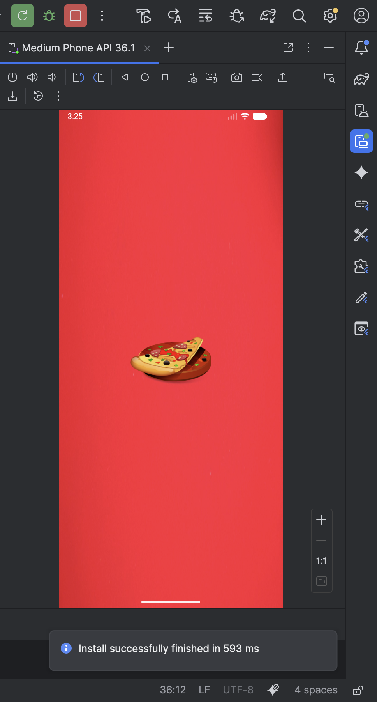
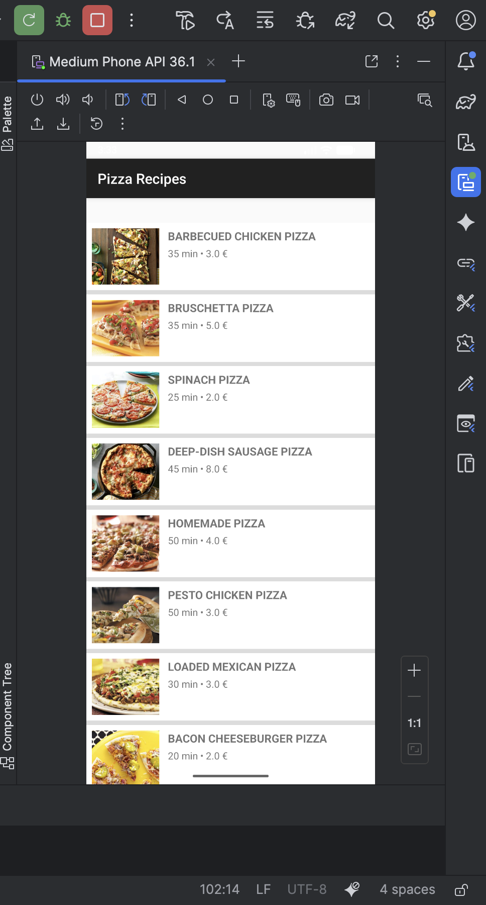
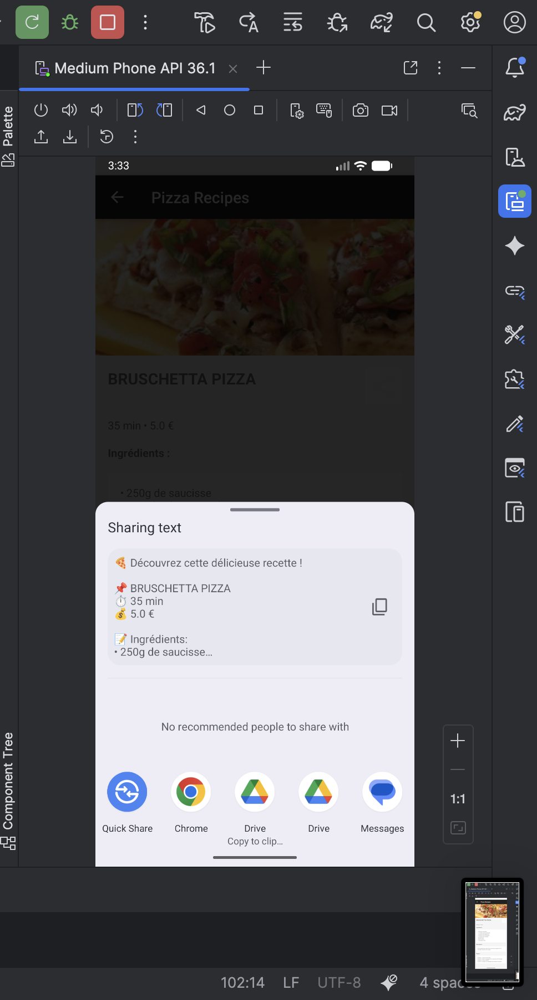

# LAB 6 – Application "Recettes de Pizza" 🍕

## Aperçu de l'application

Une application Android complète permettant de découvrir et partager des recettes de pizza. L'application présente une liste de pizzas avec leurs caractéristiques, et permet d'accéder au détail complet de chaque recette avec possibilité de partage.

| Écran Splash | Écran Liste | Écran Détail | Écran Partage |
|--------------|-------------|--------------|---------------|
|  |  |  |  |

## Fonctionnalités

- **Splash Screen** : écran d'accueil avec animation (fond `back.jpg` et logo `icon.png`)
- **Liste des pizzas** : affichage sous forme de liste avec image, nom, durée et prix
- **Détail d'une pizza** : informations complètes (ingrédients, description, étapes)
- **Partage de recette** : bouton de partage pour envoyer la recette par SMS, email, réseaux sociaux
- **Architecture MVC** : organisation en packages (classes, dao, service, adapter, ui)

## Structure du projet

```
app/
├── src/main/
│   ├── java/com.example.lab6_dev/
│   │   ├── adapter/
│   │   │   └── PizzaAdapter.java
│   │   ├── classes/
│   │   │   └── Produit.java
│   │   ├── dao/
│   │   │   └── IDao.java
│   │   ├── service/
│   │   │   └── ProduitService.java
│   │   └── ui/
│   │       ├── SplashActivity.java
│   │       ├── ListPizzaActivity.java
│   │       └── PizzaDetailActivity.java
│   ├── res/
│   │   ├── drawable/
│   │   │   ├── back.jpg
│   │   │   ├── icon.png
│   │   │   ├── pizza1.jpg à pizza10.jpg
│   │   │   └── share.png
│   │   └── layout/
│   │       ├── activity_splash.xml
│   │       ├── activity_list_pizza.xml
│   │       ├── item_pizza.xml
│   │       └── activity_pizza_detail.xml
│   └── AndroidManifest.xml
```

## Code source complet

### 1. Fichier de configuration – `AndroidManifest.xml`

```xml
<?xml version="1.0" encoding="utf-8"?>
<manifest xmlns:android="http://schemas.android.com/apk/res/android"
    package="com.example.lab6_dev">

    <application
        android:allowBackup="true"
        android:icon="@mipmap/ic_launcher"
        android:label="Pizza Recipes"
        android:roundIcon="@mipmap/ic_launcher_round"
        android:supportsRtl="true"
        android:theme="@style/Theme.AppCompat.Light.DarkActionBar">

        <activity
            android:name=".ui.SplashActivity"
            android:exported="true">
            <intent-filter>
                <action android:name="android.intent.action.MAIN" />
                <category android:name="android.intent.category.LAUNCHER" />
            </intent-filter>
        </activity>

        <activity
            android:name=".ui.ListPizzaActivity"
            android:exported="true" />

        <activity
            android:name=".ui.PizzaDetailActivity"
            android:exported="true"
            android:parentActivityName=".ui.ListPizzaActivity" />

    </application>
</manifest>
```

### 2. Classe Produit – `classes/Produit.java`

```java
package com.example.lab6_dev.classes;

public class Produit {
    private static long compteurId = 1;
    
    private long id;
    private String nom;
    private double prix;
    private int imageRes;
    private String duree;
    private String ingredients;
    private String description;
    private String etapes;

    public Produit() {
        this.id = compteurId++;
    }

    public Produit(String nom, double prix, int imageRes, String duree,
                   String ingredients, String description, String etapes) {
        this.id = compteurId++;
        this.nom = nom;
        this.prix = prix;
        this.imageRes = imageRes;
        this.duree = duree;
        this.ingredients = ingredients;
        this.description = description;
        this.etapes = etapes;
    }

    // Getters
    public long getId() { return id; }
    public String getNom() { return nom; }
    public double getPrix() { return prix; }
    public int getImageRes() { return imageRes; }
    public String getDuree() { return duree; }
    public String getIngredients() { return ingredients; }
    public String getDescription() { return description; }
    public String getEtapes() { return etapes; }
}
```

### 3. Interface DAO – `dao/IDao.java`

```java
package com.example.lab6_dev.dao;

import java.util.List;

public interface IDao<T> {
    T creer(T t);
    T modifier(T t);
    boolean supprimer(long id);
    T trouverParId(long id);
    List<T> trouverTous();
}
```

### 4. Service Produit – `service/ProduitService.java`

```java
package com.example.lab6_dev.service;

import com.example.lab6_dev.classes.Produit;
import com.example.lab6_dev.dao.IDao;
import com.example.lab6_dev.R;
import java.util.ArrayList;
import java.util.List;

public class ProduitService implements IDao<Produit> {
    
    private static ProduitService instance;
    private final List<Produit> pizzas = new ArrayList<>();

    private ProduitService() {
        initialiserDonnees();
    }

    public static ProduitService getInstance() {
        if (instance == null) {
            instance = new ProduitService();
        }
        return instance;
    }

    private void initialiserDonnees() {
        pizzas.add(new Produit("BARBECUED CHICKEN PIZZA", 3.0, R.drawable.pizza1, "35 min",
            "• 2 blancs de poulet désossés\n• 1/4 c. à café de poivre\n• 1 tasse de sauce barbecue\n• 1 pâte à pizza réfrigérée\n• 2 c. à café d'huile d'olive\n• 2 tasses de fromage Gouda\n• 1 oignon rouge\n• 1/4 tasse de coriandre",
            "Pizza au poulet barbecue, rapide et savoureuse. Parfaite pour les grillades d'été!",
            "ÉTAPE 1: Griller le poulet avec la sauce barbecue\nÉTAPE 2: Préparer la pâte sur le grill\nÉTAPE 3: Garnir de fromage, poulet et oignon\nÉTAPE 4: Cuire jusqu'à ce que le fromage fonde"));

        // Ajoutez les 9 autres pizzas ici...
    }

    @Override
    public Produit trouverParId(long id) {
        for (Produit p : pizzas) if (p.getId() == id) return p;
        return null;
    }

    @Override
    public List<Produit> trouverTous() {
        return new ArrayList<>(pizzas);
    }

    // Autres méthodes CRUD...
}
```

### 5. Adaptateur – `adapter/PizzaAdapter.java`

```java
package com.example.lab6_dev.adapter;

import android.content.Context;
import android.view.LayoutInflater;
import android.view.View;
import android.view.ViewGroup;
import android.widget.BaseAdapter;
import android.widget.ImageView;
import android.widget.TextView;
import com.example.lab6_dev.R;
import com.example.lab6_dev.classes.Produit;
import java.util.List;

public class PizzaAdapter extends BaseAdapter {
    private final Context contexte;
    private final List<Produit> listePizzas;
    private final LayoutInflater inflateur;

    public PizzaAdapter(Context contexte, List<Produit> listePizzas) {
        this.contexte = contexte;
        this.listePizzas = listePizzas;
        this.inflateur = LayoutInflater.from(contexte);
    }

    @Override public int getCount() { return listePizzas.size(); }
    @Override public Object getItem(int position) { return listePizzas.get(position); }
    @Override public long getItemId(int position) { return listePizzas.get(position).getId(); }

    @Override
    public View getView(int position, View vueRecyclee, ViewGroup parent) {
        if (vueRecyclee == null) {
            vueRecyclee = inflateur.inflate(R.layout.item_pizza, parent, false);
        }

        ImageView imagePizza = vueRecyclee.findViewById(R.id.image_pizza);
        TextView nomPizza = vueRecyclee.findViewById(R.id.nom_pizza);
        TextView infoPizza = vueRecyclee.findViewById(R.id.info_pizza);

        Produit pizza = listePizzas.get(position);
        imagePizza.setImageResource(pizza.getImageRes());
        nomPizza.setText(pizza.getNom());
        infoPizza.setText(pizza.getDuree() + " • " + pizza.getPrix() + " €");

        return vueRecyclee;
    }
}
```

### 6. SplashActivity – `ui/SplashActivity.java`

```java
package com.example.lab6_dev.ui;

import android.content.Intent;
import android.os.Bundle;
import android.os.Handler;
import androidx.appcompat.app.AppCompatActivity;
import com.example.lab6_dev.R;

public class SplashActivity extends AppCompatActivity {
    @Override
    protected void onCreate(Bundle savedInstanceState) {
        super.onCreate(savedInstanceState);
        setContentView(R.layout.activity_splash);

        if (getSupportActionBar() != null) getSupportActionBar().hide();

        new Handler().postDelayed(() -> {
            startActivity(new Intent(SplashActivity.this, ListPizzaActivity.class));
            finish();
        }, 2000);
    }
}
```

### 7. ListPizzaActivity – `ui/ListPizzaActivity.java`

```java
package com.example.lab6_dev.ui;

import android.content.Intent;
import android.os.Bundle;
import android.widget.ListView;
import androidx.appcompat.app.AppCompatActivity;
import com.example.lab6_dev.R;
import com.example.lab6_dev.adapter.PizzaAdapter;
import com.example.lab6_dev.classes.Produit;
import com.example.lab6_dev.service.ProduitService;
import java.util.List;

public class ListPizzaActivity extends AppCompatActivity {

    @Override
    protected void onCreate(Bundle savedInstanceState) {
        super.onCreate(savedInstanceState);
        setContentView(R.layout.activity_list_pizza);

        ListView listViewPizzas = findViewById(R.id.lv_pizzas);
        List<Produit> pizzas = ProduitService.getInstance().trouverTous();
        listViewPizzas.setAdapter(new PizzaAdapter(this, pizzas));

        listViewPizzas.setOnItemClickListener((parent, vue, position, id) -> {
            Intent intention = new Intent(ListPizzaActivity.this, PizzaDetailActivity.class);
            intention.putExtra("id_pizza", id);
            startActivity(intention);
        });
    }
}
```

### 8. PizzaDetailActivity – `ui/PizzaDetailActivity.java`

```java
package com.example.lab6_dev.ui;

import android.content.Intent;
import android.os.Bundle;
import android.view.View;
import android.widget.ImageButton;
import android.widget.ImageView;
import android.widget.TextView;
import android.widget.Toast;
import androidx.appcompat.app.AppCompatActivity;
import com.example.lab6_dev.R;
import com.example.lab6_dev.classes.Produit;
import com.example.lab6_dev.service.ProduitService;

public class PizzaDetailActivity extends AppCompatActivity {

    private Produit pizza;

    @Override
    protected void onCreate(Bundle savedInstanceState) {
        super.onCreate(savedInstanceState);
        setContentView(R.layout.activity_pizza_detail);

        ImageView imagePizza = findViewById(R.id.img_pizza);
        TextView titrePizza = findViewById(R.id.titre_pizza);
        TextView metaPizza = findViewById(R.id.meta_pizza);
        TextView ingredientsPizza = findViewById(R.id.ingredients_pizza);
        TextView descriptionPizza = findViewById(R.id.description_pizza);
        TextView etapesPizza = findViewById(R.id.etapes_pizza);
        ImageButton btnPartager = findViewById(R.id.btn_partager);

        long idPizza = getIntent().getLongExtra("id_pizza", -1);
        pizza = ProduitService.getInstance().trouverParId(idPizza);

        if (pizza != null) {
            imagePizza.setImageResource(pizza.getImageRes());
            titrePizza.setText(pizza.getNom());
            metaPizza.setText(pizza.getDuree() + " • " + pizza.getPrix() + " €");
            ingredientsPizza.setText(pizza.getIngredients());
            descriptionPizza.setText(pizza.getDescription());
            etapesPizza.setText(pizza.getEtapes());

            btnPartager.setOnClickListener(v -> partagerRecette());
        }
    }

    private void partagerRecette() {
        if (pizza == null) return;

        String textePartage = "🍕 Découvrez cette délicieuse recette !\n\n" +
                "📌 " + pizza.getNom() + "\n" +
                "⏱️ " + pizza.getDuree() + "\n" +
                "💰 " + pizza.getPrix() + " €\n\n" +
                "📝 Ingrédients:\n" + pizza.getIngredients() + "\n\n" +
                "👨‍🍳 Étapes:\n" + pizza.getEtapes() + "\n\n" +
                "Partagé via Pizza Recipes App";

        Intent intentPartage = new Intent(Intent.ACTION_SEND);
        intentPartage.setType("text/plain");
        intentPartage.putExtra(Intent.EXTRA_SUBJECT, "Recette: " + pizza.getNom());
        intentPartage.putExtra(Intent.EXTRA_TEXT, textePartage);
        
        startActivity(Intent.createChooser(intentPartage, "Partager la recette via"));
        Toast.makeText(this, "Partage en cours...", Toast.LENGTH_SHORT).show();
    }
}
```

### 9. Layouts XML

#### `res/layout/activity_splash.xml`

```xml
<?xml version="1.0" encoding="utf-8"?>
<FrameLayout xmlns:android="http://schemas.android.com/apk/res/android"
    android:layout_width="match_parent"
    android:layout_height="match_parent"
    android:background="@drawable/back">

    <ImageView
        android:layout_width="150dp"
        android:layout_height="150dp"
        android:src="@drawable/icon"
        android:layout_gravity="center" />
</FrameLayout>
```

#### `res/layout/activity_list_pizza.xml`

```xml
<?xml version="1.0" encoding="utf-8"?>
<LinearLayout xmlns:android="http://schemas.android.com/apk/res/android"
    android:layout_width="match_parent"
    android:layout_height="match_parent"
    android:orientation="vertical"
    android:paddingTop="?attr/actionBarSize">

    <ListView
        android:id="@+id/lv_pizzas"
        android:layout_width="match_parent"
        android:layout_height="match_parent"
        android:dividerHeight="6dp"
        android:paddingTop="8dp" />
</LinearLayout>
```

#### `res/layout/item_pizza.xml`

```xml
<?xml version="1.0" encoding="utf-8"?>
<RelativeLayout xmlns:android="http://schemas.android.com/apk/res/android"
    android:layout_width="match_parent"
    android:layout_height="96dp"
    android:padding="8dp"
    android:background="@android:color/white">

    <ImageView
        android:id="@+id/image_pizza"
        android:layout_width="96dp"
        android:layout_height="match_parent"
        android:scaleType="centerCrop" />

    <TextView
        android:id="@+id/nom_pizza"
        android:layout_width="match_parent"
        android:layout_height="wrap_content"
        android:layout_toEndOf="@id/image_pizza"
        android:layout_marginStart="12dp"
        android:textStyle="bold"
        android:textSize="16sp" />

    <TextView
        android:id="@+id/info_pizza"
        android:layout_width="match_parent"
        android:layout_height="wrap_content"
        android:layout_below="@id/nom_pizza"
        android:layout_toEndOf="@id/image_pizza"
        android:layout_marginStart="12dp"
        android:layout_marginTop="4dp" />
</RelativeLayout>
```

#### `res/layout/activity_pizza_detail.xml`

```xml
<?xml version="1.0" encoding="utf-8"?>
<ScrollView xmlns:android="http://schemas.android.com/apk/res/android"
    android:layout_width="match_parent"
    android:layout_height="match_parent"
    android:background="#f5f5f5">

    <LinearLayout
        android:layout_width="match_parent"
        android:layout_height="wrap_content"
        android:orientation="vertical"
        android:paddingTop="?attr/actionBarSize">

        <ImageView
            android:id="@+id/img_pizza"
            android:layout_width="match_parent"
            android:layout_height="200dp"
            android:scaleType="centerCrop" />

        <LinearLayout
            android:layout_width="match_parent"
            android:layout_height="wrap_content"
            android:orientation="horizontal"
            android:padding="16dp">

            <TextView
                android:id="@+id/titre_pizza"
                android:layout_width="0dp"
                android:layout_height="wrap_content"
                android:layout_weight="1"
                android:textStyle="bold"
                android:textSize="20sp" />

            <ImageButton
                android:id="@+id/btn_partager"
                android:layout_width="48dp"
                android:layout_height="48dp"
                android:src="@drawable/share"
                android:background="?attr/selectableItemBackgroundBorderless" />
        </LinearLayout>

        <TextView
            android:id="@+id/meta_pizza"
            android:layout_width="match_parent"
            android:layout_height="wrap_content"
            android:paddingHorizontal="16dp"
            android:paddingBottom="8dp" />

        <TextView
            android:layout_width="match_parent"
            android:layout_height="wrap_content"
            android:text="Ingrédients :"
            android:textStyle="bold"
            android:paddingHorizontal="16dp"
            android:paddingTop="8dp" />

        <TextView
            android:id="@+id/ingredients_pizza"
            android:layout_width="match_parent"
            android:layout_height="wrap_content"
            android:padding="16dp"
            android:background="@android:color/white"
            android:layout_margin="16dp"
            android:layout_marginTop="4dp" />

        <TextView
            android:layout_width="match_parent"
            android:layout_height="wrap_content"
            android:text="Description :"
            android:textStyle="bold"
            android:paddingHorizontal="16dp" />

        <TextView
            android:id="@+id/description_pizza"
            android:layout_width="match_parent"
            android:layout_height="wrap_content"
            android:padding="16dp"
            android:background="@android:color/white"
            android:layout_margin="16dp"
            android:layout_marginTop="4dp" />

        <TextView
            android:layout_width="match_parent"
            android:layout_height="wrap_content"
            android:text="Étapes :"
            android:textStyle="bold"
            android:paddingHorizontal="16dp" />

        <TextView
            android:id="@+id/etapes_pizza"
            android:layout_width="match_parent"
            android:layout_height="wrap_content"
            android:padding="16dp"
            android:background="@android:color/white"
            android:layout_margin="16dp"
            android:layout_marginTop="4dp"
            android:layout_marginBottom="16dp" />

    </LinearLayout>
</ScrollView>
```

## Comment exécuter l'application

1. **Créer un projet** Android Studio avec "Empty Views Activity" (Java)
2. **Package name** : `com.example.lab6_dev`
3. **Remplacer** les fichiers par ceux fournis ci-dessus
4. **Ajouter les images** dans `res/drawable/` :
   - `back.jpg` (fond du splash screen)
   - `icon.png` (logo)
   - `pizza1.jpg` à `pizza10.jpg` (images des pizzas)
   - `share.png` (icône de partage)
5. **Compiler** et exécuter sur émulateur ou appareil physique

## Points techniques abordés

- **Architecture MVC** : séparation en couches (classes, dao, service, adapter, ui)
- **Splash Screen** : écran d'accueil avec délai et animation
- **ListView personnalisée** : adapter avec vue personnalisée
- **Intent explicite** : navigation entre activités avec passage de données
- **Partage** : Intent implicite ACTION_SEND pour partager du texte
- **Gestion des ressources** : images dans drawable
- **Design responsive** : gestion de l'espace avec `?attr/actionBarSize`

---

**Auteur** : Rania Elhezzam  
